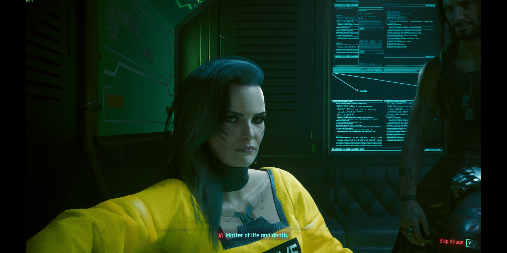
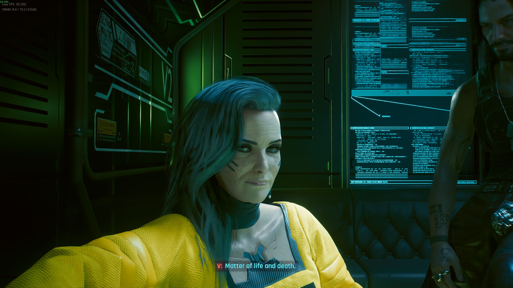
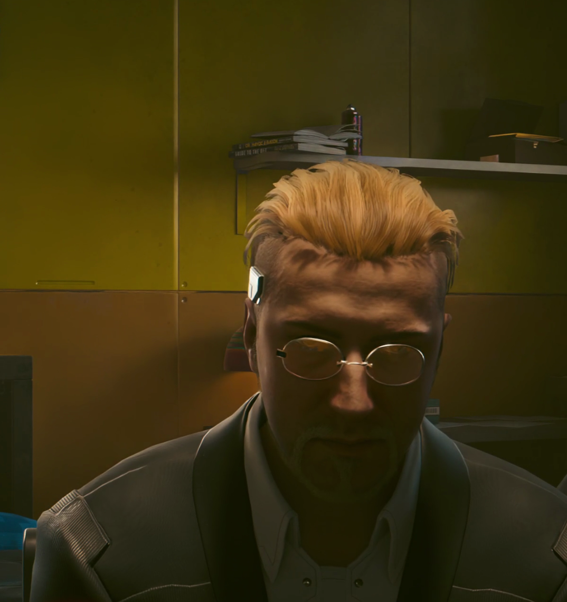
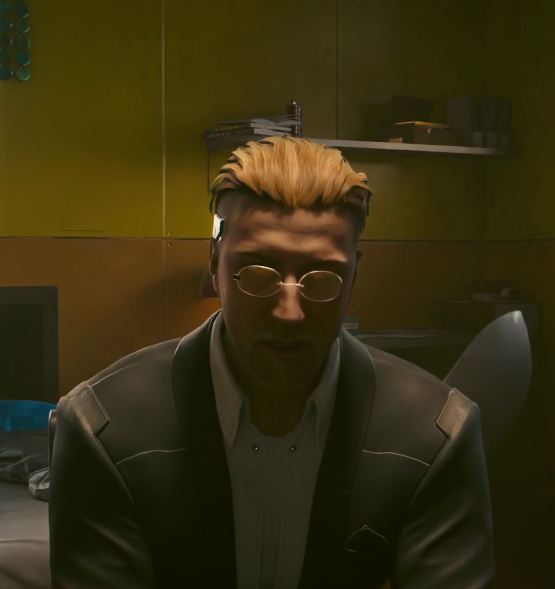

# Callisto SSS — Callisto BRDF & SSS kernel for Cyberpunk 2077

**Linux / Steam Play (Proton) · v1.0.0 · by blane · MIT license**

Better path-traced skin: the diffuse-Fresnel and retroreflection terms from the
Callisto BRDF (*"The Character Rendering Art of 'The Callisto Protocol'"*,
SIGGRAPH 2023), plus a Callisto-reshaped subsurface-scattering blur kernel.

---

## What it does

Vanilla Cyberpunk's path tracer shades skin with a plain Lambert diffuse
(`albedo/π`) plus GGX specular — **no skin-specific lobe at all**. That is a
big part of why faces can look dry, matte and gravelly, especially under
frontal lighting.

This mod makes two surgical, composable changes:

### 1. Callisto BRDF injection (the main event)

A small Vulkan layer hot-swaps the path tracer's ray-generation shader at
load time with a patched version that adds the Callisto **c1** term to skin:

- **Diffuse Fresnel** — soft, fleshy response at grazing angles instead of
  the flat Lambert falloff.
- **Retroreflection** — the subtle front-lit glow that makes skin look alive.

The patch is **skin-gated**: it only touches pixels the engine itself
classifies as skin (the exact test the game's own SSS pass uses). Every other
material renders bit-identically to vanilla, and at default parameters the
patched math degenerates to exactly the vanilla result.

### 2. Callisto-reshaped SSS blur kernel

A RED4ext plugin replaces the engine's runtime-generated subsurface diffusion
kernel with a reshaped profile (wider red-channel bleed, softened center).
Toggleable in-game via the Cyber Engine Tweaks overlay.

Ships pre-tuned to tasteful defaults — no configuration required.

---

## Requirements

- **Cyberpunk 2077 on Linux via Steam Play/Proton** (tested on NVIDIA with
  vkd3d-proton; the game must run through Proton — see FAQ)
- **[RED4ext](https://www.nexusmods.com/cyberpunk2077/mods/2380)**
- *(optional, for the in-game SSS kernel toggle)*
  **[Cyber Engine Tweaks](https://www.nexusmods.com/cyberpunk2077/mods/107)**
  with **[nativeSettings](https://www.nexusmods.com/cyberpunk2077/mods/3518)**

## Install (recommended)

1. Extract the archive anywhere.
2. Run the installer in a terminal:
   ```bash
   cd CallistoSSS-1.0.0
   ./install.sh
   ```
   It finds your game automatically (override with
   `./install.sh --game-dir "/path/to/Cyberpunk 2077"` if needed), installs
   everything, and clears the shader caches so the swap takes effect.
3. **Paste the launch-options line it prints** into Steam → Cyberpunk 2077 →
   Properties → Launch Options. It looks like:
   ```
   "<game>/red4ext/plugins/CallistoSSS/sync_settings.sh"; CALLISTO_LOG=$HOME/callisto_swap.jsonl %command%
   ```
4. Play. The first boot recompiles shaders (one-time stutter) because the
   caches were cleared.

`./install.sh --dry-run` shows every action without changing anything.

## Install (manual)

1. Drag-and-drop: copy the contents of `game/` into your game folder
   (`red4ext/plugins/CallistoSSS/`, `bin/x64/plugins/cyber_engine_tweaks/mods/CallistoSSS/`).
2. Copy `vulkan/libVkLayer_callisto_spvswap.so` and `vulkan/swaps/` to
   `~/.local/lib/callisto/`.
3. Copy `vulkan/VkLayer_callisto_spvswap.json` to
   `~/.local/share/vulkan/implicit_layer.d/` and edit its `library_path` to
   the absolute path of the `.so` from step 2.
4. Clear `<game>/bin/x64/GLCache/*` and
   `<steam library>/steamapps/shadercache/1091500/*`.
5. Set the launch options shown above.

## Verify it's working

- `vulkaninfo --summary | grep -i callisto` — the layer is registered.
- After launching the game: `grep HIT ~/callisto_swap.jsonl` — you should see
  many `"swap":"HIT"` lines (the hair compute resolves, shadow rays, and
  path-tracer raygens being substituted).
- Specifically count the compute resolves, which is where every visible effect
  lives. The log appends across launches, so truncate it first
  (`: > ~/callisto_swap.jsonl`), play, then
  `grep -c '"id":"[0-9a-f]*\.dxil".*HIT' ~/callisto_swap.jsonl` — expect ~70.
  **Zero there while the flags look healthy means a stale pipeline cache**: a
  cached pipeline never re-creates its shader module, so the layer never sees
  it. Relaunch with `CALLISTO_FORCE_CLEAR=1` prefixed to the launch options,
  or flip any CET toggle — either clears the caches.
- Vanilla control run: **turn the CET toggles off** and relaunch. That routes
  through `sync_settings.sh`, which notices the change and evicts the pipeline
  caches, so the vanilla half really is vanilla — and turning them back on
  evicts again, so the modded half really is modded.
  `CALLISTO_LAYER_DISABLE=1` also skips the layer, but it bypasses the settings
  gate: the caches keep whatever was compiled last, and the following modded
  launch can silently reuse vanilla compute pipelines. Use the toggles for A/B.

## Uninstall

Run `./uninstall.sh` (same machine; it also clears the caches so vanilla
pipelines rebuild), or remove by hand: `red4ext/plugins/CallistoSSS/`,
`bin/x64/plugins/cyber_engine_tweaks/mods/CallistoSSS/`,
`~/.local/lib/callisto/`, and
`~/.local/share/vulkan/implicit_layer.d/VkLayer_callisto_spvswap.json`,
then delete the launch-options line.

---

## FAQ

**Windows?** No — Linux/Proton only. The BRDF patch rides on the fact that
under Proton every shader reaches the GPU driver as SPIR-V, where a Vulkan
layer can substitute it. On native Windows the shaders stay DXIL and this
mechanism does not exist. (The SSS kernel plugin alone might work on Windows
but is untested and unsupported in this release.)

**Does it work without Path Tracing (RT Overdrive)?** The BRDF patch targets
the path tracer's ray-generation shader, so that part is PT-only. The SSS
kernel swap applies in all render modes.

**Performance?** Effectively free: two shader modules substituted at load,
one small texture patched at boot. No per-frame work beyond a few extra ALU
instructions on skin pixels.

**Will it conflict with other mods?** It does not touch game files, archives,
or other RED4ext plugins. Any mod that alters the same path-tracer shaders
(none are known to) would collide; everything else composes.

**Game updates?** If CDPR recompiles the path-tracer shaders, the swap files
no longer match and the layer simply passes through (vanilla look, no crash)
until an update of this mod ships.

**Where are the tunable sliders?** This release ships the BRDF at fixed,
tuned defaults. The full development pipeline (SPIR-V patcher, parameter
sliders, regeneration script) is in the source repository.

---

## How it works (technical)

- The game runs D3D12 DXR under Proton; vkd3d-proton translates every shader
  to SPIR-V before the driver sees it. `VK_LAYER_CALLISTO_spvswap` intercepts
  `vkCreateShaderModule`, identifies each module by its embedded DXIL
  `OpString` identity (`<dxil-lib-hash>.<entry>`), and substitutes patched
  SPIR-V for the two `rgs_reference_main` path-tracer permutations.
- The patch splices the Callisto c1 modulation
  `c1 = lerp(1, ρ_f, α_f) · lerp(1, ρ_r, α_r)` into the six diffuse `1/π`
  evaluation sites, gated by the engine's own skin classification
  (G-buffer material class == 1). Assembled with `spirv-as`, validated with
  `spirv-val`; at defaults it multiplies by exactly 1.0.
- The SSS blur's diffusion kernel is a runtime-generated 32×8 float texture,
  not shader code. The RED4ext plugin hooks
  `ID3D12GraphicsCommandList::CopyTextureRegion`, recognizes the vanilla
  kernel upload by a 64-byte fingerprint, and overwrites it with the reshaped
  LUT before the copy records.
- Full reverse-engineering notes, disassembly proofs and the development
  workflow are in the source repository (`analysis/` docs and `dev/`).

## Credits

- **Jorge Jimenez, Glauco Longhi, Miguel Petersen, et al.** — *"The Character
  Rendering Art of 'The Callisto Protocol'"*, SIGGRAPH 2023 Advances in
  Real-Time Rendering in Games — the BRDF math this mod implements.
- **RED4ext.SDK** (MIT) — plugin SDK.
- **vkd3d-proton / dxil-spirv** — the translation layer that makes SPIR-V
  substitution possible.
- **Cyber Engine Tweaks** and **nativeSettings** — in-game settings UI.
- **SPIRV-Tools** (`spirv-as`/`spirv-dis`/`spirv-val`) — patch authoring.

## License & permissions

MIT (see LICENSE). Do what you want with it; credit is appreciated.

---

## Hair: before / after

> **Unverified as of 2026-08-26 — do not publish this section yet.** The
> before/after pair below was shot with Ultra Plus installed, whose hair
> ray-bounce settings were not isolated; that mod's contribution was mistakenly
> read as this one's. In a clean isolation test the hair BRDF produces no
> observable change, and the likely cause is understood (the structure-tensor
> confidence gates every hair lobe and collapses them to identity — see
> `handoff/09-SETTINGS-AUDIT.md` D11). The shadow-leak fix below *is* confirmed
> independently. Re-shoot both halves with no other mods before this ships.

Vanilla path-traced hair is shaded as slightly rough plastic — one isotropic
GGX lobe, no anisotropy, no strand direction. The mod adds a Kajiya-Kay lobe
whose highlight runs *along* the strand, a roughness reshape, grazing sheen,
and a diffuse wrap that stops hair floating off the scalp.

| before | after |
|---|---|
|  |  |
|  |  |

Also fixed: an overlit gap at the hairline seam, caused by shadow rays culling
back-facing triangles — hair cards are thin double-sided quads, so cards facing
away from the light occluded nothing. See `handoff/00-ARCHITECTURE.md` §10.
